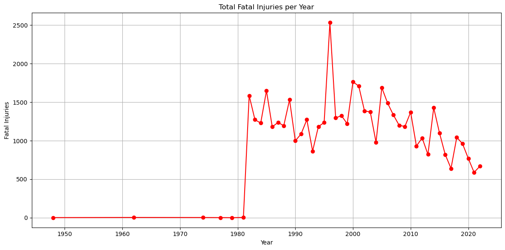
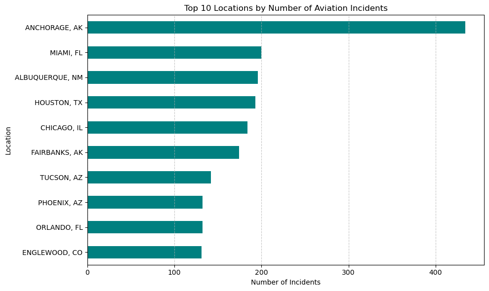
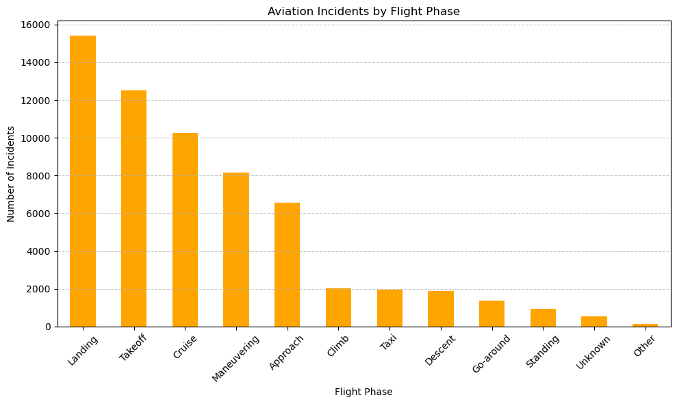

# PROJECT OVERVIEW
As part of a strategic initiative to diversify its portfolio, our company is exploring entry into the aviation sector through the acquisition and operation of aircraft for both commercial and private use. This project seeks to identify aircraft models that offer the lowest operational and safety risks, thereby supporting long-term reliability and cost efficiency. Through comprehensive analysis of industry data—including performance metrics, safety records, and maintenance histories—we aim to provide actionable insights and clear recommendations. These findings will equip the aviation division with the critical information needed to make informed, risk-conscious purchasing decisions.

# BUSINESS UNDERSTANDING
Investing in aircraft represents a substantial commitment with far-reaching implications for operational continuity, safety, and financial sustainability. Inaccurate or poorly informed decisions in aircraft selection can result in elevated maintenance costs, increased safety risks, regulatory issues, and diminished customer trust.

This project addresses these concerns by conducting a data-driven evaluation of aircraft risk profiles. Key assessment areas will include incident and accident history, mechanical reliability, safety performance, and long-term operational support. By identifying aircraft with consistently strong performance and low risk, the company can safeguard its investment, optimize fleet operations, and establish a solid foundation for success in the aviation sector.

# DATA UNDERSTANDING AND ANALYSIS
The dataset utilized for this project is sourced from the (https://www.kaggle.com/datasets/khsamaha/aviation-accident-database-synopses)Aviation Accident Database Synopses, originally compiled by the National Transportation Safety Board (NTSB). It provides detailed records of civil aviation accidents and selected incidents occurring in the United States and international waters, covering the period from 1962 through 2023.

This dataset is in CSV (comma-separated values) format, where each line represents a unique incident or accident, and the first row defines the column headers. It contains 90,348 records across 31 columns. While the dataset is rich in information, it includes a significant amount of missing data, which necessitates careful preprocessing before analysis.

Key attributes relevant to our analysis include:

*Event_ID:* A unique identifier for each incident

Make and Model: Manufacturer and model of the aircraft involved

Number of Fatalities: Critical for assessing severity and safety

Number of Minor Injuries: Helps gauge less severe but frequent incidents

Other operational and environmental factors where available

To ensure data integrity and relevance, the following preprocessing steps will be taken:

Columns with excessive missing values and little analytical value will be removed

For essential fields with limited missing entries, the affected rows will be excluded

Data types will be standardized, and inconsistencies (such as duplicates or formatting errors) will be resolved

This dataset is highly relevant to the project’s objectives, as it enables a historical and statistical evaluation of aircraft safety and performance. By analyzing trends in incident frequency, severity, and aircraft types involved, we can generate meaningful insights to support risk-aware aircraft acquisition decisions.

## Visualizations
1.Total Fatal Injuries per Year

Here's a professional write-up for the Total Fatal Injuries per Year section, which explains the plot of fatal injuries over time:

2.Top 10 Locations by Number of Aviation Incidents

This analysis identifies the geographical areas with the highest concentration of reported aviation incidents based on the dataset. By aggregating incident counts by location, we were able to highlight hotspots where aviation-related events occur more frequently.

 3.Accidents by Flight Phase

This analysis highlights the distribution of aviation accidents across different phases of flight. Due to a significant number of missing entries in the "flight phase" column, these gaps were addressed by assigning the label Unknown to ensure completeness of the analysis.
Given these insights, it is recommended that, upon aircraft acquisition, the company invests in enhanced pilot training and operational protocols specifically focused on take-off and landing procedures. This targeted approach can significantly reduce risk exposure during the most accident-prone phases of flight.

 4.Interactive Dashboard Access

To explore the findings in greater detail, the full interactive Tableau dashboard is available for review. The dashboard provides a comprehensive visualization of aviation accident trends, aircraft-specific incident frequencies, flight phase risk distribution, and other key insights derived from the dataset.[here]https://public.tableau.com/views/PHASE1PROJECT_17459315721160/Dashboard1?:language=en-US&publish=yes&:sid=&:redirect=auth&:display_count=n&:origin=viz_share_link

## CONCLUSION

Based on the analysis conducted, the management will carefully consider the recommendations provided regarding aircraft acquisition, with a focus on safety, risk mitigation, and operational efficiency. The findings indicate critical insights into accident trends, aircraft-specific performance, and risk factors across different flight phases. These will be instrumental in shaping future decisions for fleet development.

### Contacts
Project Presented By:
Newton Muhato
Data Analyst & Aviation Risk Consultant

For further inquiries or to discuss the project in more detail, feel free to reach out:

📧 newton.njeri@student.moringa.com

### Acknowlegement
I would like to extend my heartfelt thanks to my Technical Mentors:

MaryAnn Mwikali

Samwel G

Your unwavering support and expert advice have been instrumental in shaping the success of this analysis. I am truly grateful for the guidance and insights you've provided throughout this project.
